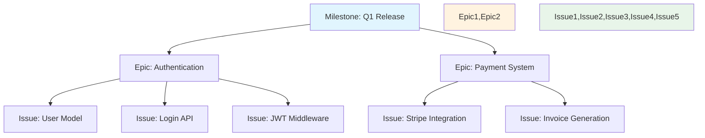

# Create a GitHub Issue

Generate a well-structured GitHub issue that Claude Code can implement in a single session.

**Usage**: `/project:create-issue $DESCRIPTION`

## Core Principle: One-Shot Capability

Every issue must be **completable in a single Claude Code session**. This means:
- Clear, bounded scope
- Self-contained implementation
- Testable outcomes
- Appropriate granularity (not too large, not too small)

> **One-Shot Test**: Can a single Claude instance meaningfully implement, test, and PR this?

Think in terms of coherent units of work - not artificial subdivisions.

## Process

### 1. Context Gathering & Repository Analysis

When called with `$MODE="batch"`:
- Read context $DESCRIPTION
- Skip interactive exploration
- Focus on generation

Otherwise:
- Parse the $DESCRIPTION
- **Scan existing issues** for duplicates or related work
- Identify the type of work needed

**Repository Intelligence**:
```bash
# Check for similar issues
gh issue list --search "[keywords from description]" --limit 20

# Check for related PRs in flight
gh pr list --search "[relevant terms]"
```

If similar work exists:
- "Found related issue #123: [title]. Is this addressing the same need?"
- "This might relate to PR #456 currently in review. Should we wait?"
- "Consider adding this to existing issue #789 instead?"

### 2. Scope Assessment & Structure Decision

**Key Decision**: What's the right GitHub structure for this work?

> **Structure Test**: Does this fit in one Claude session, or does it need decomposition?

**Dependency Analysis**:
- Check if this work requires other issues to complete first
- Identify what this might block
- Ensure proper sequencing to prevent stale issues

```bash
# Check potential dependencies
"Does this require issue #X to be completed first?"
"Would this block any existing planned work?"
```

The system should intelligently suggest the appropriate structure:

**Single Issue** (one-shottable):
- "This is perfect for a single issue - Claude can implement this in one session"
- Note dependencies: "Requires #123 to be merged first"
- Note what it enables: "This will unblock issues #456, #789"

**Epic with Sub-issues** (larger scope):
- "This should be an Epic. Let me break it down:
  - Epic: Authentication System
    - Issue #1: Create user model and database schema
    - Issue #2: Implement /auth/register endpoint (depends on #1)
    - Issue #3: Implement /auth/login endpoint (depends on #1)
    - Issue #4: Add JWT middleware (depends on #2, #3)
    - Issue #5: Create password reset flow (depends on #1)"

**Task under existing Epic**:
- "This looks like it belongs under Epic #234. Should I create it as a linked issue?"

### GitHub Projects Integration

When suggesting structure, consider:
- **Epics** for feature-level work (multiple related issues)
- **Issues** for implementation tasks (one-shot capable)
- **Dependencies** to ensure proper work sequencing
- **Labels** for categorization and workflow

### 3. Issue Construction

Based on the structure decision, create the appropriate GitHub artifact:

**For Single Issues**:
```markdown
## Title
[Clear action verb] [specific component] - Under 60 characters

## Context
Brief background and why this matters.

## Dependencies
- Requires: #[issue numbers that must complete first]
- Blocks: #[issue numbers waiting for this]
- Related: #[issues working in same area]

## Requirements
- [ ] Specific, testable requirement 1
- [ ] Specific, testable requirement 2

## Technical Notes
- Key files to modify
- Patterns to follow from CLAUDE.md

## Validation
Smoke test for reviewers:
1. Run: [specific command]
2. Try: [specific action]
3. Expect: [specific outcome]

Additional test scenarios:
- Edge case 1: [what to test]
- Edge case 2: [what to test]

## Metadata
Epic: #[epic-number] (if applicable)
Labels: backend, api, auth
Milestone: Sprint X
```

**For Epics**:
```markdown
## Epic: [Feature Name]

## Vision
What we're building and why it matters.

## Success Criteria
- [ ] User can do X
- [ ] System handles Y
- [ ] Performance meets Z

## Issues Breakdown
1. **Setup & Schema** - Database and models
2. **Core Implementation** - Main functionality  
3. **API Endpoints** - External interfaces
4. **Frontend Integration** - UI components
5. **Testing & Documentation** - Quality assurance

## Dependencies
- Requires: [other epics/issues]
- Blocks: [what depends on this]
```

### 4. Output

**Interactive Mode**: 
- Present issue for review
- Offer to create on GitHub via `gh issue create`

**Batch Mode** (when `$MODE="batch"`):
- Save to `$OUTPUT_DIR/issue-[timestamp]-[slug].md`
- Include metadata header for tracking
- Return confirmation

## Key Behaviors

- **Think implementation-first**: How will Claude Code approach this?
- **Be specific**: Vague requirements lead to implementation drift
- **Include context**: Link to relevant docs, patterns, examples
- **Define success clearly**: Concrete validation steps

## The One-Shot Principle

The command understands that **"one-shot" applies at different scales**:

✅ **One-Shot Issue**: Single Claude session → PR
✅ **One-Shot Epic**: Single planning session → Multiple coordinated issues
✅ **One-Shot Milestone**: Single sprint → Multiple epics

The intelligence is in **recognizing the appropriate level** for the work described.

## Sizing Examples with Structure

**Single Issue** (coherent units of work):
- "Implement user authentication endpoints with JWT" → One issue
- "Create checkout flow with Stripe integration" → One issue
- "Build admin dashboard with user management" → One issue

**Epic with Issues** (feature-level decomposition):
- "E-commerce platform" → Epic containing:
  - Issue: Product catalog with search
  - Issue: Shopping cart with persistence
  - Issue: Checkout with payment processing
  - Issue: Order management system

Don't artificially subdivide coherent work - Claude can handle substantial implementations in a single session.

## GitHub Projects Intelligence

The command leverages GitHub's full organizational hierarchy:



This creates **navigable structure** in GitHub Projects boards.

## Remember

The goal is to create issues that set Claude Code up for success. Think of each issue as a **focused mission** with clear objectives, adequate context, and measurable success criteria.