```mermaid
graph TD
    A[🖥️ Commands Layer] --> B[🔄 Workflows Layer]
    B --> C[🏗️ Core Layer] 
    C --> D[🔧 Shared Layer]
    
    A1[setup-command.ts] --> A
    A2[work-on-task-command.ts] --> A
    A3[cleanup-command.ts] --> A
```

# CLAUDE.md - Vocs Documentation Guide

*Complete reference for creating and formatting documentation using Vocs*

## Document Structure & Frontmatter

### Standard MDX Frontmatter
```mdx
---
title: Your Page Title
description: Brief description for SEO and navigation
layout: landing  # Optional: use for special layouts
---
```

### Advanced Frontmatter Options
```mdx
---
title: Architecture Overview
description: Understanding Claude Swarm's 4-layer architecture and design principles
sidebar_position: 1
tags: [architecture, core-concepts, design-patterns]
---
```

## Content Organization Patterns

### Landing Page Structure (index.mdx)
```mdx
---
layout: landing
---

# Main Title

Brief description with **emphasized text**

:::tip[🚀 Call to Action]
Jump into our [Quick Start Guide](/getting-started) to get started.
:::

## Key Features Section
- **🌳 Feature One**: Description
- **🖥️ Feature Two**: Description  
- **🔗 Feature Three**: Description

### Architecture Diagram


## What's Next Section
<div style={{
  display: 'grid',
  gridTemplateColumns: 'repeat(2, 1fr)',
  gap: 'var(--vocs-space_16)',
  marginTop: 'var(--vocs-space_32)'
}}>
  <!-- Grid cards with inline styles -->
</div>
```

### Standard Content Page Structure
```mdx
---
title: Page Title
description: SEO description
---

# Page Title

Brief introduction paragraph explaining what this page covers.

:::tip[Quick Summary]
Key takeaway or summary for busy readers
:::

## Main Section
Content with subsections...

### Code Examples
```typescript {4,8-12} showLineNumbers filename="src/example.ts"
// Code with highlighting and line numbers
```

## Next Steps
- Link to related pages
- Suggested actions

:::info[Additional Information]
Helpful context or next steps
:::
```

## Callout Patterns

### Available Callout Types
```mdx
:::tip[Title]
Helpful tips and best practices
:::

:::warning[Important]
Critical warnings and prerequisites
:::

:::info[Additional Context]
Extra information and clarifications
:::

:::note[Remember]
Important things to keep in mind
:::

:::danger[Critical]
Serious warnings about potential issues
:::
```

### Callout with Icons
```mdx
:::tip[🚀 Pro Tips]
- Use **descriptive agent IDs** to organize work
- Set up **shell aliases** for common commands
:::

:::warning[Prerequisites]
Before you begin, make sure you have:
- **Node.js** 18+ or **Bun** 1.0+
- **Git** 2.25+ (for worktree support)
:::
```

## Code Examples & Syntax Highlighting

### Basic Code Blocks
```mdx
```bash
# Simple bash commands
npm install -g @claude-swarm/cli
```

```typescript
// TypeScript examples
interface WorktreeOptions {
  path: string
  branch: string
}
```
```

### Advanced Code Formatting
```mdx
```typescript {4,8-12} showLineNumbers filename="src/core/worktree.ts"
import { GitOps } from './git'
import { ErrorFactory, ERROR_CODES } from '../shared/errors'

export class WorktreeManager {
  constructor(private gitOps: GitOps) {}

  async createWorktree(options: WorktreeOptions): Promise<Worktree> {
    // Validate repository state
    const isValid = await this.gitOps.isValidRepository(options.basePath)
    if (!isValid) {
      throw ErrorFactory.worktree(ERROR_CODES.WORKTREE_INVALID_REPOSITORY)
    }

    return await this.gitOps.createWorktree(options)
  }
}
```
```

### Multi-language Code Examples
```mdx
```bash
# Installation
npm install -g claude-codex
```

```javascript
// Configuration
const config = {
  github: { token: process.env.GITHUB_TOKEN },
  tmux: { enabled: true }
}
```

```json
// Package.json snippet
{
  "scripts": {
    "dev": "claude-codex start --dev"
  }
}
```
```

## Mermaid Diagrams

### Architecture Diagrams
```mdx

```

### Flow Diagrams
```mdx

```

### Sequence Diagrams
```mdx

```

## Component Patterns

### Custom React Components in MDX
```mdx
<div style={{
  display: 'grid',
  gridTemplateColumns: 'repeat(2, 1fr)',
  gap: 'var(--vocs-space_16)',
  marginTop: 'var(--vocs-space_32)'
}}>
  <div style={{
    border: '1px solid var(--vocs-color_border)',
    borderRadius: 'var(--vocs-borderRadius_8)',
    padding: 'var(--vocs-space_16)',
    backgroundColor: 'var(--vocs-color_background2)',
  }}>
    <h3>📚 Learn the Basics</h3>
    <p>Understand core concepts and architecture</p>
    <a href="/concepts/architecture">Core Concepts →</a>
  </div>
</div>
```

### Feature Grid Layout
```mdx
### 🎯 Key Features

- **🌳 Git Worktree Management**: Create isolated development environments
- **🖥️ Tmux Integration**: Seamless terminal session handling
- **🔗 GitHub Integration**: Direct connection with issues and repositories  
- **🎨 Web UI**: Modern interface for workflow management
- **🔧 Library-First Design**: Extensible core modules
- **🤖 Multi-Agent Support**: Multiple Claude instances with isolation
```

## Navigation & Linking

### Internal Links
```mdx
- [Quick Start Guide](/getting-started)
- [Core Concepts](/concepts/architecture)
- [API Reference](/api/core)
```

### Link with Context
```mdx
Learn about [Worktree Management](/concepts/worktrees) concepts and understand [Agent Isolation](/concepts/agents) strategies.
```

### Cross-References
```mdx
:::info[Next Steps]
- Learn about [Worktree Management](/concepts/worktrees) concepts
- Understand [Agent Isolation](/concepts/agents) strategies  
- Explore the [Core API Reference](/api/core)
:::
```

## Workflow Documentation Patterns

### Step-by-Step Processes
```mdx
### Working on a Task

```bash
# Start working on a specific GitHub issue
claude-swarm work-on-task --issue 123

# Or work on a custom branch
claude-swarm work-on-task --branch feature/new-login
```

This creates:
- 🌳 **Isolated worktree** for the task
- 🖥️ **Dedicated tmux session** (if enabled)
- 📋 **Agent-specific context** directory
- 🔗 **GitHub issue linkage** (if applicable)
```

### Common Workflows Section
```mdx
## Common Workflows

### 🐛 Bug Fix Workflow

```bash
# 1. Start working on bug report
claude-swarm work-on-task --issue 456 --agent-id bug-hunter

# 2. Your environment is ready!
# - Worktree: /project/worktrees/bug-456
# - Tmux session: cs-bug-456
# - Context: ~/.claude-swarm/contexts/bug-hunter

# 3. After fixing, clean up
claude-swarm cleanup --worktree bug-456
```

### ✨ Feature Development

```bash
# 1. Start feature work
claude-swarm work-on-task --branch feature/user-auth --agent-id auth-expert

# 2. Develop in isolation
# 3. Clean up while preserving work
claude-swarm cleanup --worktree feature-user-auth --preserve-context
```
```

## Troubleshooting Patterns

### FAQ Style
```mdx
## Troubleshooting

### Common Issues

#### Git Worktree Errors
```bash
# If you get "worktree already exists" errors
claude-swarm cleanup --worktree WORKTREE_NAME --force

# Check git worktree status
git worktree list
```

#### Configuration Issues
```bash
# View current configuration
claude-swarm config list

# Reset to defaults
claude-swarm config reset
```
```

### Problem-Solution Format
```mdx
:::warning[Common Problem]
**Issue**: Tmux sessions not starting properly

**Solution**: Check tmux configuration and ensure version 3.0+
```bash
# Check tmux version
tmux -V

# Kill stuck sessions
tmux kill-session -t cs-SESSION_NAME
```
:::
```

## API Documentation Patterns

### Interface Documentation
```mdx
### WorktreeManager Interface

```typescript
export interface WorktreeManagerInterface {
  createWorktree(options: WorktreeOptions): Promise<Worktree>
  removeWorktree(path: string): Promise<boolean>
  listWorktrees(): Promise<Worktree[]>
}
```

#### Parameters
- `options: WorktreeOptions` - Configuration for the new worktree
- `path: string` - Absolute path to the worktree to remove

#### Returns
- `Promise<Worktree>` - Created worktree information
- `Promise<boolean>` - Success status of removal
```

### Error Handling Documentation
```mdx
### Error Codes

```typescript
export const ERROR_CODES = {
  WORKTREE_EXISTS: 'WORKTREE_EXISTS',
  GIT_COMMAND_FAILED: 'GIT_COMMAND_FAILED',
  GITHUB_AUTH_FAILED: 'GITHUB_AUTH_FAILED'
} as const
```

#### Error Factory Usage
```typescript
// ✅ Use standardized error codes and factories
throw ErrorFactory.worktree(ERROR_CODES.WORKTREE_EXISTS, "Worktree already exists", { path });

// ❌ Never throw generic errors
throw new Error("Something went wrong");
```
```

## Best Practices

### Content Writing
- Start with **brief introductions** explaining the page purpose
- Use **action-oriented headings** (e.g., "Setting Up", "Working With")
- Include **practical examples** for every concept
- End sections with **"Next Steps"** or related links

### Code Examples
- Always include **working examples** that users can copy-paste
- Use **syntax highlighting** with language specification
- Add **line highlighting** for important lines: `{4,8-12}`
- Include **filenames** when showing file contents: `filename="src/core.ts"`
- Use **showLineNumbers** for longer examples

### Visual Elements
- Use **emojis sparingly** in headings for visual hierarchy
- Include **Mermaid diagrams** for complex processes
- Use **callouts** to highlight important information
- Create **grid layouts** for feature comparisons

### Navigation
- Always include **cross-references** to related content
- End pages with **"Next Steps"** sections
- Use **consistent link patterns** throughout the site
- Include **breadcrumb context** in descriptions

This guide covers all the essential patterns found in the Vocs documentation system. Use these patterns consistently to create professional, user-friendly documentation that follows the established conventions.