# Architecture Overview

Claude Swarm is built on a **clean 4-layer architecture** that promotes maintainability, testability, and extensibility. This guide explains how the layers work together and why this structure matters.

:::tip[Quick Architecture Summary]
```
User CLI → Commands → Workflows → Core → Shared
```
Each layer has a specific responsibility and can only depend on layers below it.
:::

## The 4-Layer Architecture

```mermaid
graph TD
    A[🖥️ Commands Layer] --> B[🔄 Workflows Layer]
    B --> C[🏗️ Core Layer] 
    C --> D[🔧 Shared Layer]
    
    A1[setup-command.ts] --> A
    A2[work-on-task-command.ts] --> A
    A3[cleanup-command.ts] --> A
    
    B1[setup-project.ts] --> B
    B2[work-on-task.ts] --> B
    B3[cleanup-worktree.ts] --> B
    
    C1[worktree.ts] --> C
    C2[git.ts] --> C
    C3[github.ts] --> C
    C4[tmux.ts] --> C
    C5[claude.ts] --> C
    C6[files.ts] --> C
    
    D1[types.ts] --> D
    D2[errors.ts] --> D
    D3[config.ts] --> D
    D4[validation.ts] --> D
```



### 🖥️ Commands Layer
**Purpose**: CLI entry points that handle user interaction

```typescript
// Example: commands/setup-command.ts
export async function setupCommand(options: SetupOptions): Promise<void> {
  try {
    // Input validation and parsing
    const validatedOptions = validateSetupOptions(options)
    
    // Delegate to workflow
    await setupProjectWorkflow(validatedOptions)
    
    // Handle success/error reporting
    console.log('✅ Project setup completed successfully!')
  } catch (error) {
    handleCommandError(error)
    process.exit(1)
  }
}
```

**Responsibilities**:
- Parse CLI arguments and flags
- Validate user input
- Call appropriate workflows
- Handle error reporting and success messages
- Exit code management

### 🔄 Workflows Layer
**Purpose**: Orchestrate multiple core operations into cohesive processes

```typescript {8-15}
// Example: workflows/setup-project.ts
export async function setupProjectWorkflow(
  options: SetupProjectOptions,
  deps: WorkflowDependencies = defaultDependencies
): Promise<SetupResult> {
  const { gitOps, worktreeManager, configManager } = deps
  
  // Orchestrate multiple core operations
  const repository = await gitOps.validateRepository(options.path)
  const config = await configManager.initializeProject(options)
  const baseWorktree = await worktreeManager.createBase(config)
  
  return {
    repository,
    config,
    baseWorktree
  }
}
```

**Responsibilities**:
- Coordinate multiple core modules
- Handle business logic and process flow
- Manage transactions and rollback
- Error handling and recovery
- Return structured results

### 🏗️ Core Layer
**Purpose**: Reusable building blocks with single responsibilities

The core layer contains specialized modules:

#### `core/worktree.ts` - Git Worktree Management
```typescript
export class WorktreeManager {
  async createWorktree(options: WorktreeOptions): Promise<Worktree> {
    // Pure worktree creation logic
  }
  
  async removeWorktree(path: string): Promise<boolean> {
    // Safe worktree removal
  }
  
  async listWorktrees(): Promise<Worktree[]> {
    // Enumerate existing worktrees
  }
}
```

#### `core/git.ts` - Git Operations
```typescript
export class GitOps {
  async validateRepository(path: string): Promise<Repository> {
    // Repository validation logic
  }
  
  async createBranch(name: string, base?: string): Promise<Branch> {
    // Branch creation logic
  }
}
```

#### `core/github.ts` - GitHub Integration
```typescript
export class GitHubOps {
  async getIssue(issueNumber: number): Promise<Issue> {
    // GitHub API integration
  }
  
  async createPullRequest(options: PROptions): Promise<PullRequest> {
    // PR creation logic
  }
}
```

**Key Principles**:
- **Single Responsibility**: Each module handles one domain
- **Pure Functions**: No side effects where possible
- **Dependency Injection**: Easy to test and mock
- **Error Handling**: Consistent error patterns

### 🔧 Shared Layer
**Purpose**: Common utilities and foundational code

```typescript
// shared/types.ts - Type definitions
export interface WorktreeOptions {
  path: string
  branch: string
  upstream?: string
  agentId?: string
}

// shared/errors.ts - Standardized error handling
export const ERROR_CODES = {
  WORKTREE_EXISTS: 'WORKTREE_EXISTS',
  GIT_COMMAND_FAILED: 'GIT_COMMAND_FAILED',
  GITHUB_AUTH_FAILED: 'GITHUB_AUTH_FAILED'
} as const

export class ErrorFactory {
  static worktree(code: string, message: string, context?: any) {
    return new WorktreeError(code, message, context)
  }
}

// shared/config.ts - Configuration management
export interface ClaudeSwarmConfig {
  github: GitHubConfig
  tmux: TmuxConfig
  worktree: WorktreeConfig
}
```

## Design Principles

### 1. Dependency Direction
Dependencies flow **downward only**:

```typescript
// ✅ Allowed: Commands can use Workflows
import { setupProjectWorkflow } from '../workflows/setup-project'

// ✅ Allowed: Workflows can use Core
import { WorktreeManager } from '../core/worktree'

// ❌ Forbidden: Core cannot use Workflows
// import { setupProjectWorkflow } from '../workflows/setup-project'
```

### 2. Library-First Design
Every component is designed as a **reusable library**:

```typescript
// ✅ Core modules export clean interfaces
export interface WorktreeManagerInterface {
  createWorktree(options: WorktreeOptions): Promise<Worktree>
  removeWorktree(path: string): Promise<boolean>
}

// ✅ Workflows are composable
export const setupProjectWorkflow = (
  options: SetupProjectOptions,
  deps: WorkflowDependencies = defaultDependencies
) => {
  // Implementation that can be used by any consumer
}
```

### 3. Pure Functions & Dependency Injection
Core functions avoid hidden dependencies:

```typescript
// ✅ Dependencies are explicit and injectable
async function createWorktree(
  options: WorktreeOptions, 
  gitOps: GitOps = new DefaultGitOps()
) {
  return gitOps.createWorktree(options)
}

// ❌ Hidden dependency makes testing difficult
async function createWorktree(options: WorktreeOptions) {
  return exec(`git worktree add ${options.path}`) // Hidden system dependency
}
```

### 4. Hierarchical Error Handling
Errors bubble up through layers with context:

```typescript
// Core layer - specific errors
throw ErrorFactory.git(ERROR_CODES.GIT_COMMAND_FAILED, 'Failed to create branch', { 
  command: 'git checkout -b feature' 
})

// Workflow layer - adds business context
catch (error) {
  throw ErrorFactory.workflow(ERROR_CODES.WORKFLOW_SETUP_FAILED, 
    'Project setup failed during branch creation', { 
      originalError: error,
      projectPath: options.path 
    })
}

// Command layer - user-friendly message
catch (error) {
  console.error('❌ Setup failed:', error.message)
  if (error.context) {
    console.error('Context:', error.context)
  }
}
```

## Benefits of This Architecture

### 🧪 **Testability**
Each layer can be tested in isolation:

```typescript
// Test core modules with mocked dependencies
const mockGitOps = {
  createWorktree: vi.fn().mockResolvedValue(mockWorktree)
}
const worktreeManager = new WorktreeManager(mockGitOps)

// Test workflows with mocked core modules
const result = await setupProjectWorkflow(options, {
  gitOps: mockGitOps,
  worktreeManager: mockWorktreeManager
})
```

### 🔧 **Maintainability**
Clear separation of concerns makes changes predictable:
- UI changes → Commands layer only
- Business logic changes → Workflows layer
- Implementation changes → Core layer
- Utility changes → Shared layer

### 🚀 **Extensibility**
New features follow established patterns:

```typescript
// Adding a new core module
export class DatabaseOps {
  async migrateSchema(): Promise<void> { /* ... */ }
}

// Adding a new workflow
export async function deployProjectWorkflow(
  options: DeployOptions,
  deps: { databaseOps: DatabaseOps; gitOps: GitOps }
) {
  // Orchestrate deployment using core modules
}

// Adding a new command
export async function deployCommand(options: DeployOptions) {
  await deployProjectWorkflow(options)
}
```

## Real-World Example

Here's how a complete user action flows through the architecture:

```bash
claude-swarm work-on-task --issue 123 --agent-id bug-hunter
```

### 1. Commands Layer
```typescript
// commands/work-on-task-command.ts
export async function workOnTaskCommand(options: WorkOnTaskOptions) {
  const validatedOptions = validateWorkOnTaskOptions(options)
  const result = await workOnTaskWorkflow(validatedOptions)
  console.log(`✅ Ready to work on ${result.issue.title}`)
}
```

### 2. Workflows Layer
```typescript
// workflows/work-on-task.ts
export async function workOnTaskWorkflow(options: WorkOnTaskOptions) {
  // Get issue details
  const issue = await githubOps.getIssue(options.issueNumber)
  
  // Create worktree
  const worktree = await worktreeManager.createWorktree({
    path: `./worktrees/issue-${options.issueNumber}`,
    branch: `issue-${options.issueNumber}`,
    agentId: options.agentId
  })
  
  // Set up tmux session
  const session = await tmuxOps.createSession({
    name: `cs-issue-${options.issueNumber}`,
    workingDirectory: worktree.path
  })
  
  return { issue, worktree, session }
}
```

### 3. Core Layer
```typescript
// core/worktree.ts
export class WorktreeManager {
  async createWorktree(options: WorktreeOptions): Promise<Worktree> {
    // Validate path
    await this.validateWorktreePath(options.path)
    
    // Create git worktree
    const result = await this.gitOps.createWorktree(options)
    
    // Set up agent context
    if (options.agentId) {
      await this.claudeOps.setupAgentContext(options.agentId, result.path)
    }
    
    return result
  }
}
```

### 4. Shared Layer
```typescript
// shared/types.ts
export interface WorktreeOptions {
  path: string
  branch: string
  agentId?: string
}

// shared/errors.ts
export const ERROR_CODES = {
  WORKTREE_EXISTS: 'WORKTREE_EXISTS'
} as const
```

This architecture ensures that Claude Swarm is **maintainable**, **testable**, and **extensible** while providing a clean separation of concerns that makes the codebase easy to understand and modify.

:::info[Next Steps]
- Learn about [Worktree Management](/concepts/worktrees) concepts
- Understand [Agent Isolation](/concepts/agents) strategies  
- Explore the [Core API Reference](/api/core)
:::