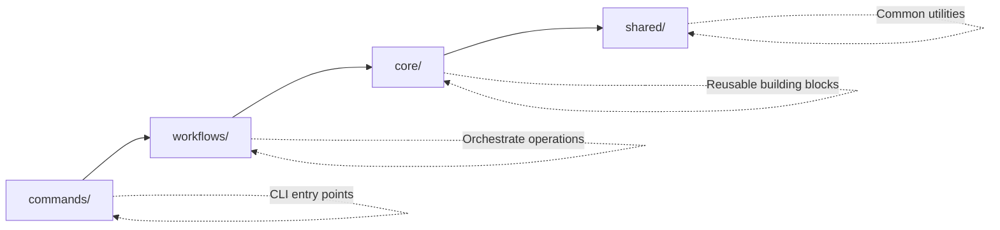

# Claude Swarm

A **multi-agent development environment** that revolutionizes how you manage git worktrees, tmux sessions, and development workflows.

:::tip[🚀 Ready to get started?]
Jump into our [Quick Start Guide](/getting-started) to set up Claude Swarm in minutes.
:::

## Why Claude Swarm?

Modern development requires juggling multiple features, bug fixes, and experiments simultaneously. Claude Swarm creates **isolated development environments** that keep your work organized and your main branch clean.

### 🎯 Key Features

- **🌳 Git Worktree Management**: Create and manage isolated development environments
- **🖥️ Tmux Integration**: Seamlessly handle terminal sessions with context switching
- **🔗 GitHub Integration**: Connect directly with GitHub issues and repositories  
- **🎨 Web UI**: Modern terminal interface for visual workflow management
- **🔧 Library-First Design**: Extensible core modules for custom integrations
- **🤖 Multi-Agent Support**: Run multiple Claude instances with proper isolation

### 🏗️ Clean Architecture

Claude Swarm follows a proven 4-layer architecture pattern:



- **commands/**: CLI entry points that provide the user interface
- **workflows/**: Orchestrate multiple core operations into cohesive processes
- **core/**: Reusable building blocks (worktree, git, github, tmux, claude, files)
- **shared/**: Common utilities (types, errors, config, validation)

## Quick Example

```bash
# Set up a new project workspace
claude-swarm setup my-project

# Start working on a GitHub issue
claude-swarm work-on-task --issue 123

# Clean up when done
claude-swarm cleanup --worktree feature-123
```

:::info[Library-First Philosophy]
Every component in Claude Swarm is designed as a **reusable library**. Whether you're building custom workflows or integrating with existing tools, our APIs provide the flexibility you need.
:::

## What's Next?

<div style={{
  display: 'grid',
  gridTemplateColumns: 'repeat(2, 1fr)',
  gap: 'var(--vocs-space_16)',
  marginTop: 'var(--vocs-space_32)'
}}>
  <div style={{
    border: '1px solid var(--vocs-color_border)',
    borderRadius: 'var(--vocs-borderRadius_8)',
    padding: 'var(--vocs-space_16)',
    backgroundColor: 'var(--vocs-color_background2)',
    transition: 'all 0.2s ease',
  }}>
    <h3 style={{
      margin: '0 0 var(--vocs-space_8) 0',
      fontSize: 'var(--vocs-fontSize_18)',
      fontWeight: 'var(--vocs-fontWeight_semibold)',
      color: 'var(--vocs-color_heading)'
    }}>
      📚 Learn the Basics
    </h3>
    <p style={{
      margin: '0 0 var(--vocs-space_12) 0',
      fontSize: 'var(--vocs-fontSize_14)',
      color: 'var(--vocs-color_text2)',
      lineHeight: 'var(--vocs-lineHeight_paragraph)'
    }}>
      Understand core concepts and architecture
    </p>
    <a href="/concepts/architecture" style={{
      color: 'var(--vocs-color_textAccent)',
      textDecoration: 'none',
      fontSize: 'var(--vocs-fontSize_14)',
      fontWeight: 'var(--vocs-fontWeight_medium)'
    }}>
      Core Concepts →
    </a>
  </div>

  <div style={{
    border: '1px solid var(--vocs-color_border)',
    borderRadius: 'var(--vocs-borderRadius_8)',
    padding: 'var(--vocs-space_16)',
    backgroundColor: 'var(--vocs-color_background2)',
    transition: 'all 0.2s ease',
  }}>
    <h3 style={{
      margin: '0 0 var(--vocs-space_8) 0',
      fontSize: 'var(--vocs-fontSize_18)',
      fontWeight: 'var(--vocs-fontWeight_semibold)',
      color: 'var(--vocs-color_heading)'
    }}>
      ⚡ Quick Start
    </h3>
    <p style={{
      margin: '0 0 var(--vocs-space_12) 0',
      fontSize: 'var(--vocs-fontSize_14)',
      color: 'var(--vocs-color_text2)',
      lineHeight: 'var(--vocs-lineHeight_paragraph)'
    }}>
      Get up and running in minutes
    </p>
    <a href="/getting-started" style={{
      color: 'var(--vocs-color_textAccent)',
      textDecoration: 'none',
      fontSize: 'var(--vocs-fontSize_14)',
      fontWeight: 'var(--vocs-fontWeight_medium)'
    }}>
      Quick Start →
    </a>
  </div>

  <div style={{
    border: '1px solid var(--vocs-color_border)',
    borderRadius: 'var(--vocs-borderRadius_8)',
    padding: 'var(--vocs-space_16)',
    backgroundColor: 'var(--vocs-color_background2)',
    transition: 'all 0.2s ease',
  }}>
    <h3 style={{
      margin: '0 0 var(--vocs-space_8) 0',
      fontSize: 'var(--vocs-fontSize_18)',
      fontWeight: 'var(--vocs-fontWeight_semibold)',
      color: 'var(--vocs-color_heading)'
    }}>
      🔧 API Reference
    </h3>
    <p style={{
      margin: '0 0 var(--vocs-space_12) 0',
      fontSize: 'var(--vocs-fontSize_14)',
      color: 'var(--vocs-color_text2)',
      lineHeight: 'var(--vocs-lineHeight_paragraph)'
    }}>
      Detailed API documentation
    </p>
    <a href="/api/core" style={{
      color: 'var(--vocs-color_textAccent)',
      textDecoration: 'none',
      fontSize: 'var(--vocs-fontSize_14)',
      fontWeight: 'var(--vocs-fontWeight_medium)'
    }}>
      API Docs →
    </a>
  </div>

  <div style={{
    border: '1px solid var(--vocs-color_border)',
    borderRadius: 'var(--vocs-borderRadius_8)',
    padding: 'var(--vocs-space_16)',
    backgroundColor: 'var(--vocs-color_background2)',
    transition: 'all 0.2s ease',
  }}>
    <h3 style={{
      margin: '0 0 var(--vocs-space_8) 0',
      fontSize: 'var(--vocs-fontSize_18)',
      fontWeight: 'var(--vocs-fontWeight_semibold)',
      color: 'var(--vocs-color_heading)'
    }}>
      🎮 Try It Out
    </h3>
    <p style={{
      margin: '0 0 var(--vocs-space_12) 0',
      fontSize: 'var(--vocs-fontSize_14)',
      color: 'var(--vocs-color_text2)',
      lineHeight: 'var(--vocs-lineHeight_paragraph)'
    }}>
      Interactive playground and examples
    </p>
    <a href="/playground" style={{
      color: 'var(--vocs-color_textAccent)',
      textDecoration: 'none',
      fontSize: 'var(--vocs-fontSize_14)',
      fontWeight: 'var(--vocs-fontWeight_medium)'
    }}>
      Playground →
    </a>
  </div>
</div>