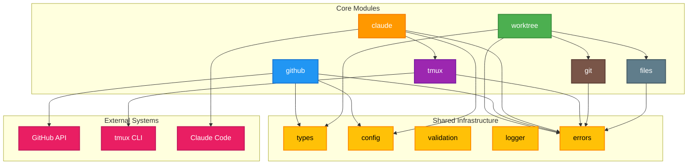

# Core Modules & Dependencies

This diagram shows the six core modules and their interdependencies, along with their relationships to shared infrastructure and external systems.

## Module Dependencies

### Core Module Relationships
- **worktree** depends on **git** and **files** for repository operations and file management
- **claude** depends on **tmux** for session management
- **github** uses **types** for structured data handling

### Shared Infrastructure Usage
All core modules depend on:
- **types** - TypeScript interfaces and type definitions
- **errors** - Standardized error handling
- **config** - Configuration management (where applicable)

### External System Integration
- **github** → GitHub API (REST/GraphQL via Octokit)
- **tmux** → tmux CLI for terminal session management
- **claude** → Claude Code CLI for AI interactions

## Implementation Order

Based on dependencies, implement in this order:
1. **Shared Infrastructure** (types, errors, config, validation, logger)
2. **git** - Foundation for repository operations
3. **files** - File system utilities
4. **tmux** - Independent session management
5. **worktree** - Builds on git and files
6. **github** - External API integration
7. **claude** - Builds on tmux integration 