# Workflow Orchestration

This sequence diagram shows how the "Work on Task" workflow orchestrates multiple core modules to create a complete development environment.

```mermaid
sequenceDiagram
    participant User
    participant CLI as Command Entry
    participant WF as Work-on-Task Workflow
    participant GH as github module
    participant WT as worktree module
    participant F as files module
    participant T as tmux module
    participant C as claude module
    
    User->>CLI: bun work-on-task.ts 123
    CLI->>WF: runWorkflow({issueNumber: 123})
    
    Note over WF: 1. Validate Environment
    WF->>GH: detectRepository()
    GH-->>WF: RepositoryInfo
    WF->>GH: getIssueWithRelationships(123)
    GH-->>WF: GitHubIssueComplete
    
    Note over WF: 2. Create Development Environment
    WF->>WT: createWorktree({name: "task-123", sourceBranch: "main"})
    WT-->>WF: WorktreeInfo
    WF->>F: ensureClaudeContext(worktreePath)
    F-->>WF: success
    
    Note over WF: 3. Launch Interactive Session
    WF->>T: createTmuxSession({name: "swarm-task-123", workingDirectory: worktreePath})
    T-->>WF: TmuxSessionInfo
    WF->>C: launchClaudeInteractive({sessionName, workPrompt})
    C-->>WF: ClaudeSessionInfo
    
    Note over WF: 4. Provide User Feedback
    WF-->>CLI: Environment ready message
    CLI-->>User: ✅ Development environment ready!<br/>tmux attach -t swarm-task-123
```

## Workflow Phases

### 1. Environment Validation
- **Repository Detection**: Verify we're in a valid Git repository with GitHub remote
- **Issue Retrieval**: Fetch complete issue context including project relationships
- **Prerequisites Check**: Ensure all required tools (git, tmux, claude) are available

### 2. Development Environment Creation
- **Worktree Creation**: Create isolated git worktree for the specific task
- **Context Setup**: Copy Claude configuration files to the new worktree
- **Branch Management**: Create and checkout appropriate branch for the task

### 3. Interactive Session Launch
- **tmux Session**: Create dedicated terminal session for the task
- **Claude Integration**: Launch Claude Code with context-aware work prompt
- **Process Coordination**: Ensure Claude runs within the tmux session

### 4. User Handoff
- **Status Reporting**: Provide clear feedback on environment readiness
- **Access Instructions**: Give user the exact command to attach to the session
- **Monitoring Setup**: Enable user to monitor progress via tmux

## Error Handling

Each phase includes comprehensive error handling:
- **Validation Failures**: Clear error messages with remediation steps
- **Resource Conflicts**: Automatic cleanup and retry logic
- **External Dependencies**: Graceful degradation when services unavailable
- **Cleanup on Failure**: Automatic removal of partially created resources

## Other Workflows

Similar orchestration patterns apply to:
- **Review Task Workflow**: Creates review environment and validation prompts
- **Setup Project Workflow**: Initializes GitHub project and Claude configuration
- **Cleanup Review Workflow**: Archives feedback and removes temporary resources 