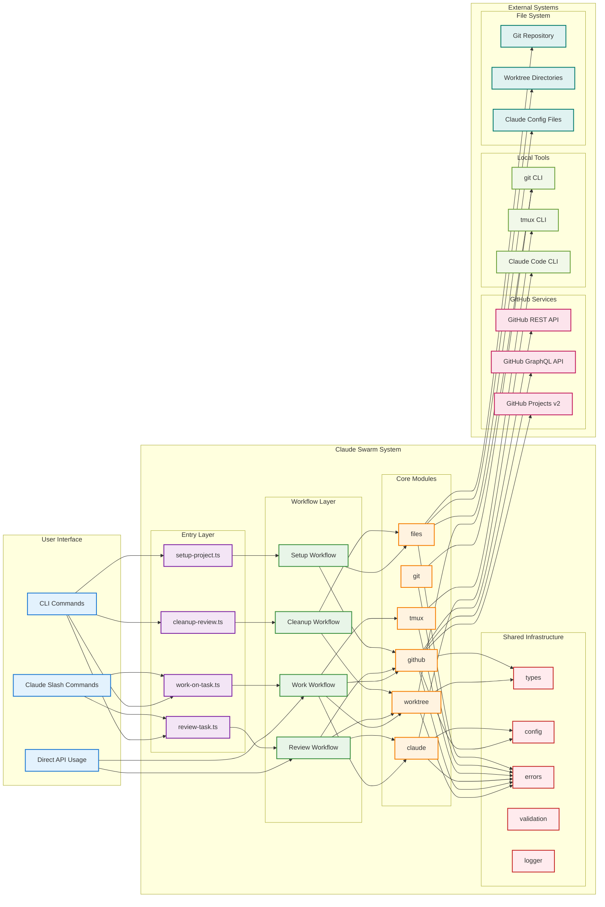

# System Integration

This diagram shows the complete Claude Swarm system and its integration with external services, tools, and file systems.

## Integration Points

### User Interface Layer (Blue)
Multiple ways users can interact with the system:
- **CLI Commands**: Direct execution of workflow scripts via Bun
- **Claude Slash Commands**: Integration with Claude Code for seamless AI workflow
- **Direct API Usage**: Programmatic access for other tools and integrations

### System Architecture Flow
1. **Entry Layer** (Purple): Command scripts that parse arguments and invoke workflows
2. **Workflow Layer** (Green): Business logic orchestration of core modules
3. **Core Modules** (Orange): Specialized functionality for specific domains
4. **Shared Infrastructure** (Red): Common utilities and cross-cutting concerns

### External System Dependencies

#### GitHub Services (Pink)
- **REST API**: Issue management, repository operations, PR creation
- **GraphQL API**: Complex queries for project relationships and metadata
- **Projects v2**: Advanced project management and custom field handling

#### Local Tools (Light Green)
- **git CLI**: Repository operations, branch management, worktree creation
- **tmux CLI**: Terminal session management and process isolation
- **Claude Code CLI**: AI-powered development sessions

#### File System (Teal)
- **Git Repository**: Source code and version control
- **Worktree Directories**: Isolated development environments
- **Claude Config Files**: AI context and command configurations

## Key Integration Patterns

### Authentication & Authorization
- **GitHub Token**: Required for all GitHub API operations
- **Local Permissions**: File system access for worktree and config management
- **Tool Availability**: Runtime checks for required CLI tools

### Data Flow
- **Configuration Cascade**: User → Project → System → Defaults
- **Error Propagation**: Structured errors bubble up through layers
- **State Management**: Consistent state across worktrees and sessions

### Resource Management
- **Cleanup Patterns**: Automatic cleanup of temporary resources
- **Conflict Resolution**: Handle concurrent operations and resource conflicts
- **Health Monitoring**: Validate external dependencies and system state

## Deployment Considerations

### Prerequisites
- Node.js/Bun runtime environment
- Git CLI with repository access
- tmux for session management
- Claude Code CLI for AI integration
- GitHub token with appropriate permissions

### Installation Modes
- **Global Installation**: `bunx claude-swarm` for system-wide access
- **Project Installation**: Local installation in specific repositories
- **Development Mode**: Direct execution from source for development

### Configuration Management
- **Environment Variables**: Runtime configuration overrides
- **Config Files**: Persistent settings at user and project levels
- **Auto-Detection**: Intelligent defaults based on environment analysis 