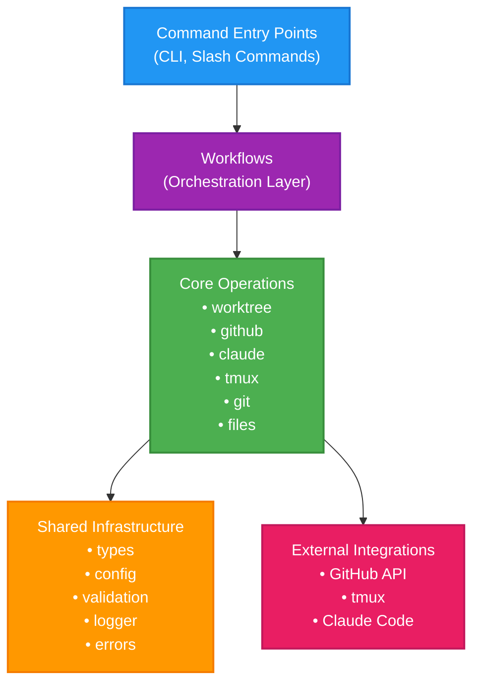

# High-Level System Architecture

This diagram shows the layered architecture of the Claude Swarm system, from user entry points down to shared infrastructure.

## Architecture Flow

1. **Command Entry Points** - Users interact via CLI commands or Claude slash commands
2. **Workflows** - Orchestrate multiple core operations to complete business processes
3. **Core Operations** - Six specialized modules that handle specific domains
4. **Shared Infrastructure** - Common utilities and types used by all modules
5. **External Integrations** - Third-party systems that core modules connect to

## Key Design Principles

- **Layered Architecture**: Clear separation of concerns across layers
- **Dependency Flow**: Higher layers depend on lower layers, not vice versa
- **Shared Foundation**: All modules built on common infrastructure
- **External Isolation**: External integrations accessed only through core modules 