# Shared Infrastructure

This diagram shows how the shared infrastructure provides foundational support to all core modules through types, error handling, configuration, and utilities.

```mermaid
graph TB
    subgraph "Shared Infrastructure Foundation"
        subgraph "Type System"
            T1[RepositoryInfo]
            T2[WorktreeInfo]
            T3[GitHubIssue]
            T4[TmuxSessionInfo]
            T5[ClaudeSessionInfo]
        end
        
        subgraph "Error Handling"
            E1[SwarmError<br/>Base Class]
            E2[WorktreeError]
            E3[GitHubError]
            E4[TmuxError]
            E5[ClaudeError]
            E6[GitError]
            E7[FileError]
        end
        
        subgraph "Configuration"
            C1[SwarmConfig]
            C2[WorktreeConfig]
            C3[GitHubConfig]
            C4[ClaudeConfig]
            C5[TmuxConfig]
        end
        
        subgraph "Validation & Utilities"
            V1[Input Validation]
            V2[Schema Validation]
            L1[Logger]
            L2[Progress Reporting]
        end
    end
    
    subgraph "Core Modules Usage"
        M1[worktree module]
        M2[github module]
        M3[claude module]
        M4[tmux module]
        M5[git module]
        M6[files module]
    end
    
    %% Type dependencies
    T1 --> M2
    T1 --> M5
    T2 --> M1
    T3 --> M2
    T4 --> M4
    T5 --> M3
    
    %% Error handling
    E1 --> E2
    E1 --> E3
    E1 --> E4
    E1 --> E5
    E1 --> E6
    E1 --> E7
    
    E2 --> M1
    E3 --> M2
    E4 --> M4
    E5 --> M3
    E6 --> M5
    E7 --> M6
    
    %% Configuration
    C1 --> C2
    C1 --> C3
    C1 --> C4
    C1 --> C5
    
    C2 --> M1
    C3 --> M2
    C4 --> M3
    C5 --> M4
    
    %% Validation and utilities
    V1 --> M1
    V1 --> M2
    V1 --> M3
    V2 --> M2
    L1 --> M1
    L1 --> M2
    L1 --> M3
    L1 --> M4
    L2 --> M1
    L2 --> M2
    
    style T1 fill:#E3F2FD,stroke:#1976D2,stroke-width:2px
    style T2 fill:#E3F2FD,stroke:#1976D2,stroke-width:2px
    style T3 fill:#E3F2FD,stroke:#1976D2,stroke-width:2px
    style T4 fill:#E3F2FD,stroke:#1976D2,stroke-width:2px
    style T5 fill:#E3F2FD,stroke:#1976D2,stroke-width:2px
    
    style E1 fill:#FFEBEE,stroke:#C62828,stroke-width:2px
    style E2 fill:#FFEBEE,stroke:#C62828,stroke-width:2px
    style E3 fill:#FFEBEE,stroke:#C62828,stroke-width:2px
    style E4 fill:#FFEBEE,stroke:#C62828,stroke-width:2px
    style E5 fill:#FFEBEE,stroke:#C62828,stroke-width:2px
    style E6 fill:#FFEBEE,stroke:#C62828,stroke-width:2px
    style E7 fill:#FFEBEE,stroke:#C62828,stroke-width:2px
    
    style C1 fill:#F3E5F5,stroke:#7B1FA2,stroke-width:2px
    style C2 fill:#F3E5F5,stroke:#7B1FA2,stroke-width:2px
    style C3 fill:#F3E5F5,stroke:#7B1FA2,stroke-width:2px
    style C4 fill:#F3E5F5,stroke:#7B1FA2,stroke-width:2px
    style C5 fill:#F3E5F5,stroke:#7B1FA2,stroke-width:2px
    
    style V1 fill:#E8F5E8,stroke:#388E3C,stroke-width:2px
    style V2 fill:#E8F5E8,stroke:#388E3C,stroke-width:2px
    style L1 fill:#FFF3E0,stroke:#F57C00,stroke-width:2px
    style L2 fill:#FFF3E0,stroke:#F57C00,stroke-width:2px
    
    style M1 fill:#FAFAFA,stroke:#424242,stroke-width:2px
    style M2 fill:#FAFAFA,stroke:#424242,stroke-width:2px
    style M3 fill:#FAFAFA,stroke:#424242,stroke-width:2px
    style M4 fill:#FAFAFA,stroke:#424242,stroke-width:2px
    style M5 fill:#FAFAFA,stroke:#424242,stroke-width:2px
    style M6 fill:#FAFAFA,stroke:#424242,stroke-width:2px
```

## Infrastructure Components

### Type System (Blue)
Provides TypeScript interfaces and type definitions that ensure type safety across all modules:
- **RepositoryInfo**: Git repository metadata used by github and git modules
- **WorktreeInfo**: Worktree state information for worktree module
- **GitHubIssue**: Complete GitHub issue data structures
- **TmuxSessionInfo**: Terminal session management data
- **ClaudeSessionInfo**: AI session state and configuration

### Error Handling (Red)
Hierarchical error system with base `SwarmError` class:
- **Module-Specific Errors**: Each core module has its own error class
- **Consistent Error Codes**: Standardized error identification
- **Structured Error Data**: Rich error context for debugging
- **Error Recovery**: Patterns for graceful error handling

### Configuration (Purple)
Hierarchical configuration system:
- **SwarmConfig**: Root configuration containing all module configs
- **Module Configs**: Specific configuration for each core module
- **Environment Overrides**: Support for development/production settings
- **Validation**: Configuration schema validation

### Validation & Utilities (Green/Orange)
Cross-cutting concerns used by multiple modules:
- **Input Validation**: Parameter validation for all public functions
- **Schema Validation**: JSON schema validation for complex data
- **Logger**: Structured logging with multiple output formats
- **Progress Reporting**: User feedback during long-running operations

## Design Principles

### Consistency
- **Naming Conventions**: Consistent patterns across all interfaces
- **Error Patterns**: Standardized error handling approach
- **Configuration Structure**: Uniform configuration hierarchy

### Extensibility
- **Interface Segregation**: Small, focused interfaces
- **Composition Over Inheritance**: Favor composition patterns
- **Plugin Architecture**: Easy to add new modules

### Testability
- **Dependency Injection**: Easy to mock dependencies
- **Pure Functions**: Minimal side effects where possible
- **Clear Contracts**: Well-defined input/output specifications 